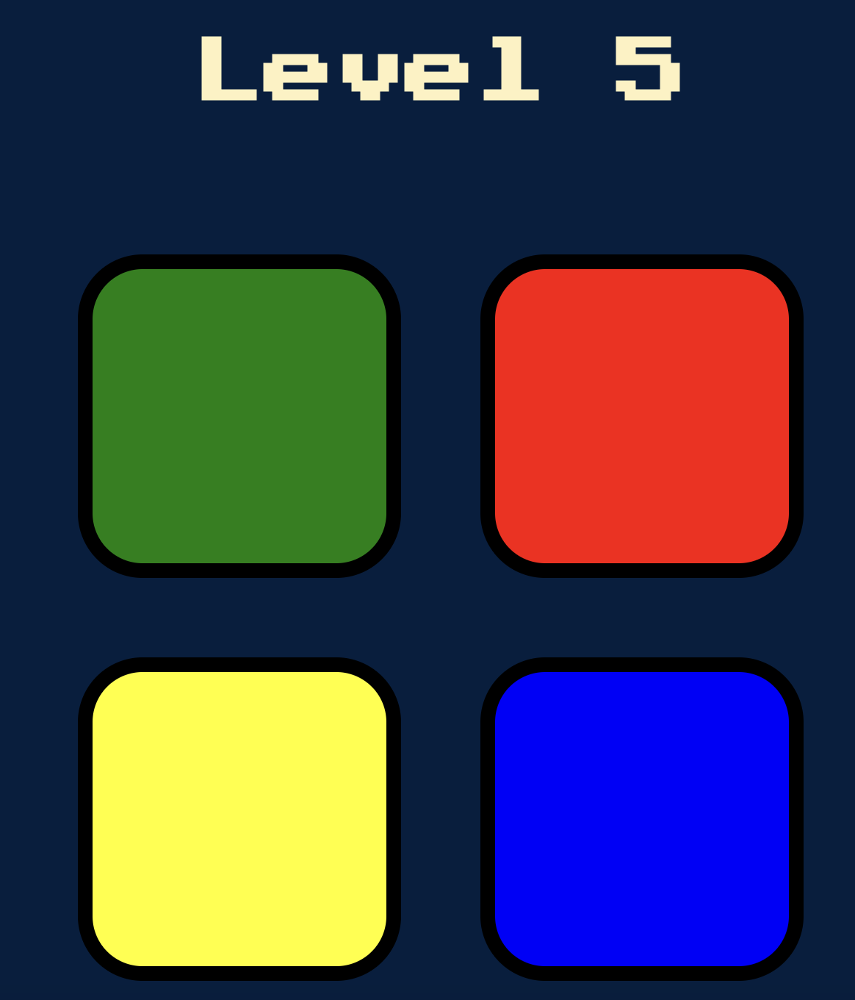
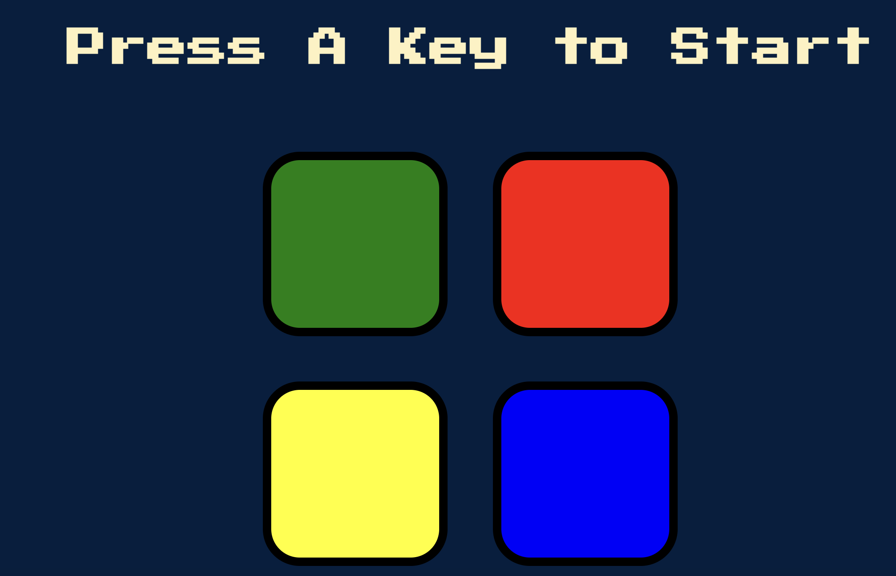

# Simon Game 🎮

This is a simple Simon game implementation using HTML, CSS, and JavaScript.

## Screenshots

Add some eye-catching screenshots to showcase your game!

*Screenshot 1: Game in Progress*

*Screenshot 2: Game Over*

## How to Play

Describe how to play your game here...

## Installation

Explain how to install or run your game locally...

## Credits

Give credit to any resources or tutorials you used...

## License

This project is licensed under the MIT License - see the [LICENSE.md](LICENSE.md) file for details.
